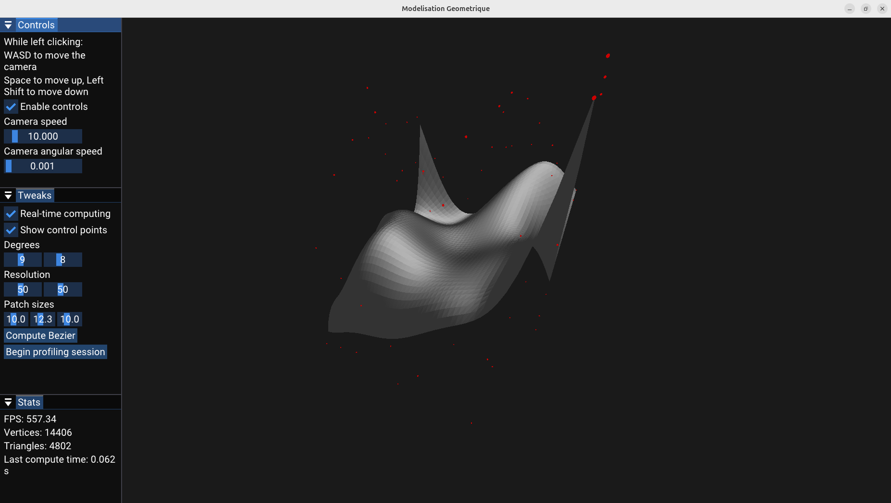

# TP de Modélisation Géométrique

Modelisation of Bézier surfaces with real-time settings edition and displaying results as meshes.

## Screenshots




## Building project

### Windows

#### Visual Studio

In repository root folder, open a terminal and type :

```bash
mkdir build
cd build
cmake ..
```

#### VS Code

You can also build the project by opening the root folder on VS Code, and use the "CMake" and "CMake Tools" VS Code extensions (that is my workflow).

### Linux

> **_NOTE:_**  Linux target has not been tested yet, but it should work at least on Ubuntu and Fedora.

Install required dependencies:
```bash
sudo apt install libglfw3-dev
```

#### CMake/Make

- In repository root folder, open a terminal and type:
```bash
mkdir build
cd build
cmake ..
cmake --build . --parallel
```

- Launching program:
```bash
cd TP # Don't use ./TP/TP directly because the program won't be able to load resource files.
./TP
```

#### VS Code

You can also build the project by opening the root folder on VS Code, and use the "CMake" and "CMake Tools" VS Code extensions. You might also need to install the [Ninja build system](https://github.com/ninja-build/ninja) if it is not already installed on your system:

```bash
sudo apt install ninja-build
```

## Dependencies

- [Vroom](https://github.com/Hypooxanthine/Vroom), my 3D library written in C++/OpenGL (I modified it a bit to fit the needs of this project)
- [imgui](https://github.com/ocornut/imgui), for the GUI